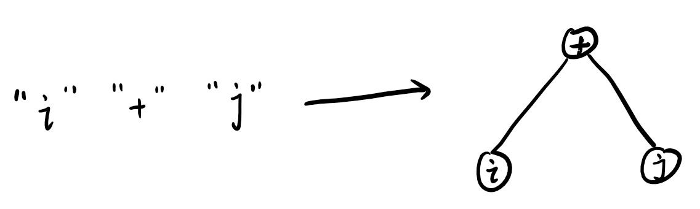
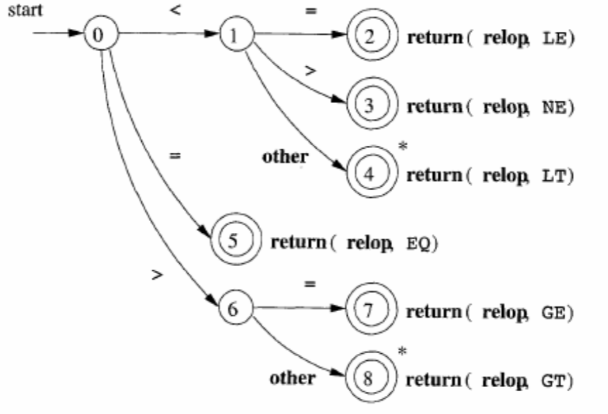

####说明
该笔记是以网课《编译原理》为基础做的，其与正规描述可能有所偏差，一切《编译原理》笔记以“龙书”为准。
##编译原理
这门课程的主要目的就是解决问题：高级语言如何变成机器可以识别的语言，以实现各种各样的程序。
####编译器概述
是一种被抽象的机器，其输入一种语言，输出另一种语言。我们常说的编译器是该机器的子集，其接受高级语言输入，输出各种能让底层理解并执行的代码。常见的.c文件会被编译成x86指令集，.java文件会被编译成字节码...
####编译器简单结构
简单的来说，一般会经历：
1.词法分析
2.文法分析（又称语法分析）
3.语义分析
4.代码生成
而在这几个过程中，不可避免地会出现中间文件：
1.记号序列
2.抽象语法树
3.中间代码
这么说会觉得很单调，以一个很简单的例子来说明：
高级语言：i+j,其中，i，j均为整型数；
机器指令：以栈式计算机为例，所要涉及的指令
1.push a:压栈
2.add :加，其会进行两次弹栈，再进行加操作，然后再进行压栈；

首先第一步词法分析：
将会得到
```
IDENT(i),'+',IDENT(j),EOF
```
>说明
（1）所有的空格会被略去，只是因为空格不属于我们所说的正则字符集内部（词法分析会详细介绍，简单的可以理解为空格无意义）；
（2）会在后面加入EOF，此表示程序结束；
>
第二步文法分析：

>说明：语法树采用后序遍历
>
第三步语义分析：
由于示例过于简单，无须中间代码

第四步代码生成：
```x86asm
push i
push j
add
```
下来就分步介绍
####词法分析
首先，我们将被分析后得到的最小单元称为记号，记号可能是操作符，关键字，变量，空格，回车...那也就是说，我们的目的是将一串字符串转换为正规的数据结构。
#####定义数据结构
```c
enum mark={main,if,IDENT,lparent,...};//...只是省略过多但是有限的记号
struct token{
    enum mark k;
    char* lexeme;//记号可能还有对应的参数，如IDENT(1),其中1就是参数
};
```
好了，输入和输出有了，现在就到了实现程序的步骤了，在实现前有必要进行分类：手动实现与自动实现
手工构造法：复杂，情况可控，是主流的实现方法，像gcc.llvm都是手工实现的；
生成器：代码量少，但细节不可控；

1. 手工构造
为请晰地分析问题，引入状态转移图的概念：
（1）一定有初始状态和结束状态
（2）有转移条件
（3）有固定的状态
以最简单的模型为例：比较运算的分析

>其中strat以及开头的箭头（一般是斜向箭头）表示起始状态;
>两个同心圆套在一起表示一个结束状态（有可能是多个）;
>每一个圆圈表示一个状态;
>箭头上的信息表示表示转移条件;
>特别地此图中*代表一次回滚，然后由于其处于结束状态，也就是说状态在进行一次回滚之后就会结束分析;

很明显，这样的操作过于复杂，因此会利用哈希表来进行优化
等待后续补充
2. 生成器
由于手工法过于复杂，因此举例过于简单，在生成器中将讨论相对完整的分析器算法。
一个代码段，所包含的字符串一共有多少种？
理论是无限的，但是其情况是有限的，也就是我们所说的正则表达式：
给定字符集Σ，其包含代码段所有的可能字符（ASCⅡ，Unicode...）,以下均是正则表达式:
(1)空字符ε
(2)a|b(a,b均属于字符集)
(3)ab
(4)a*(a的闭包，即为集合{a,aa,aaa,aaaa,...})
也就是说，所有可能的字符都会出现在正则表达式内。
输入规范化了之后，便正式进入操作过程：
**有限状态自动机（FA）**
FA的作用是接受字符串，然后给出yes或no，表示该字符串能否被接受,其定义如下：
M={Σ(字符集),S(状态集),q0(初始状态),F(结束状态集),σ(转移函数)};


